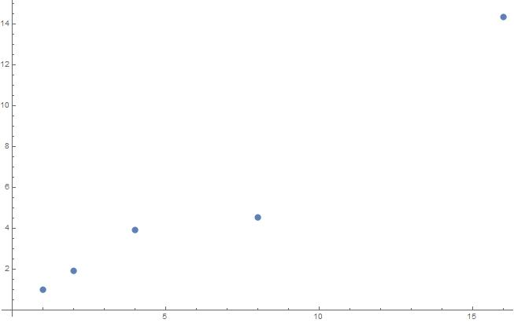

# Report

## pi.c
### Algorithm analysis
The algorithm runs in two main phases, one is serial and the other one is parallel.  
The serial part is initialisation. It consists of setting the number of threads wanted, creating one random number generator per thread and put them in an array, and declaring and initializing an array of variables for counting the points that will land inside the circle (one per thread). This part is executed once, and run therefore in O(1).

The parallel phase is the calculus phase and look like this :  

```C
    #pragma omp parallel for
    for (size_t i = 0; i < samples; ++i) {
        double x = next_rand(rand);
        double y = next_rand(rand);
        if (x*x + y*y < 1){
            result[omp_get_thread_num()] += 1;
        }
    }
```
For each samples needed, we generate two random numbers, representing the X and Y coordinates of a points. If the distance between the point and the origin is less than 1, it is in the circle, and need to be added to result[omp_get_thread_num()]. Because each thread has its own variable in the array, there is no need to add an atomic condition.  
As every iteration of the loop is independent, it is possible to run it in a parallel manner. The dominant operation is the distance computation, and it runs overall in O(samples).  

## integral.c
### Algorithm analysis

The algorithm is very similar to _pi.c_, so it will not be detailed.  
The initialisation part run in constant time (O(1)), and the calculus part runs in O(samples).  


## Parallelism 
Roughly, 95% of each programm can be parallel, so a significant speedup is expected. Here is the graph of the expected speedup for 1, 2, 4, 8, 16, 32 and 64 cores.  


Here is the effective speed up we obtain after running our code on the cluster with 1, 2, 4, 8 and 16 threads. For each number of thread we ran the program 100 times.


