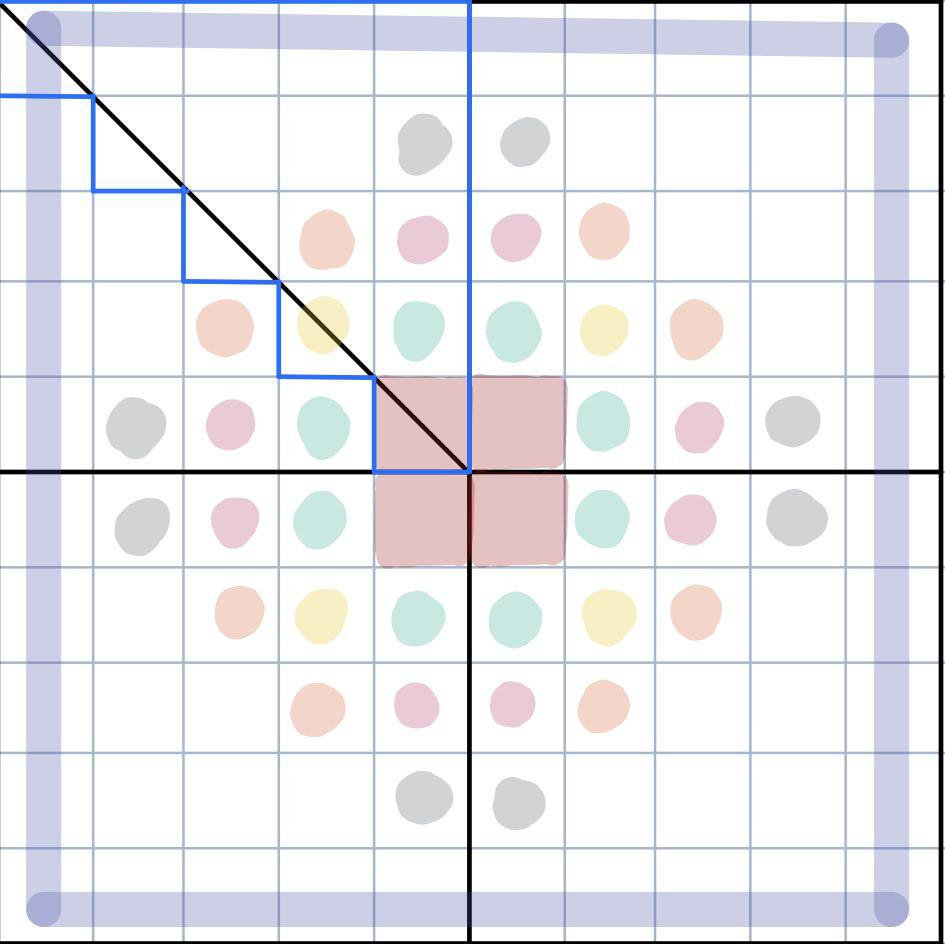

# Assignment 2

## Optimizations
### Algorithm optimization
First of all, we observed that the grid can be cut into 8 symetrical parts like this :

The 8 parts are symetrical so we can compute for only one of them (the blue one on the) and then just populate the other with the same value but with a axial symetry. This leads to a gain in performance by a factor of  more or less 8 due to loss of time when copying all values in the rest of the grid. The only critical parts are when we compute the cells that are at the border. When we need a cell that is in a part that we do not compute, we just use its symetrical sister that is in the computed region.

We did another observation: the central part that is not at temperature 0 grows with the number of iterations and eventually reachs the border. We can then compute only a reduced part of the matrix and grow this part at each iteration. This reduces significantly the execution time as long as the number of iterations is less than the grid size.

### Parallelization
First we put the two *for loop* in parallel section and the outer *for loop* in a *#pragma omp for parallel*. Then we tried to add a padding to reduce the amount of false sharing, but it augmented the execution time. To achieve the padding, we had to copy both *input* and *output* arrays in two new arrays and add some empty spaces between each double. We allocated 8 times more space that the initial grid but only for the first quarter (because we only use this part during computation). This led to an array size of : *(length/2)\*(length/2)\*8*, and access of the form : *pOutput[8\*index]*.

The problem was that we couldn't pad the arrays we received so we had to work on others and by doing this, we had to copy the array we used to compute in the output array we received as argument. As the amount of data is pretty huge, the copy takes more time than the false sharing problem and our program ran 3x slower with the padding. 

We therefore decided to remove it because we were looking for the best performance.

## Performance
Here are the execution time we obtain.

Execution times are shown for 1, 2, 4, 8, 16 threads in seconds for the naive algorithm (what was given to us) and our program run for 10'000x10'000 array and for 100 iterations.

| Execution time | 1 thread | 2 threads | 4 threads | 8 threads | 16 threads |
|---|---|---|---|---|---|
| Naive| 25.08 | | | | |
| Our version | 1.051 | 0.8028 | 0.4735 | 0.2643 | 0.2104 |

| Speedup | 1 thread | 2 threads | 4 threads | 8 threads | 16 threads |
|---|---|---|---|---|---|
| Naive| 1 | | | | |
| Our version | 23.86 | 31.31 | 53.36 | 94.89 | 119.20 |